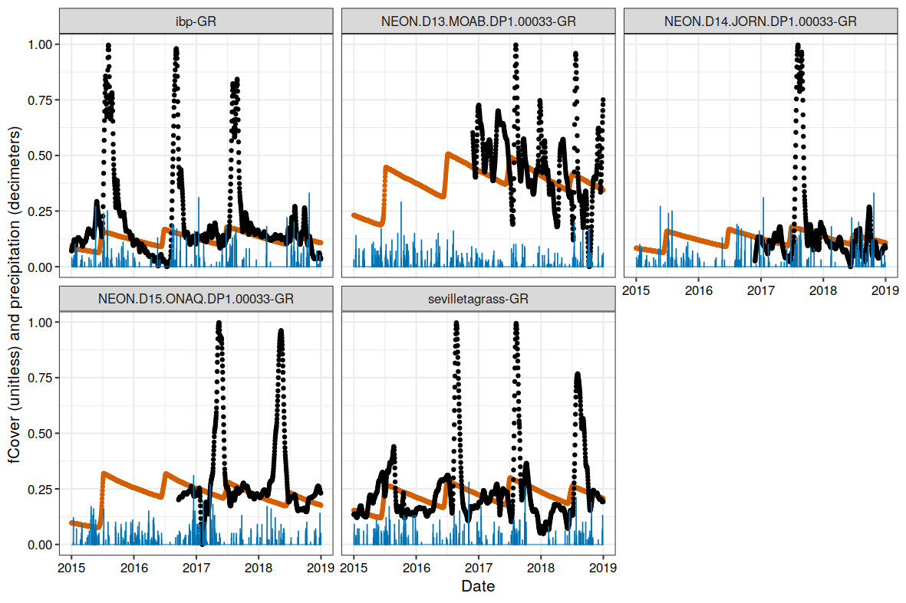

## Multi-scale assessment of a grassland productivity model
**Shawn D. Taylor, Dawn M. Browning**

Supplementary Table A1 & Image A1  

\newpage

\begin{table}
\caption{Sites used in analysis. A * indicates the site was also used in the original analysis.}
\small
\begin{tabular}{l|r|r|l|r|l|l|r|l}
\hline
name & lat & lon & vegetation & roi\_id & first\_date & last\_date & site\_years & ecoregion\\
\hline
ahwahnee & 37.75 & -119.58 & GR & 3000 & 2015-07-28 & 2020-03-05 & 4.6 & NWForests\\
\hline
archboldavir & 27.18 & -81.22 & AG & 1000 & 2016-11-18 & 2020-03-05 & 3.1 & ETempForests\\
\hline
archboldavirx & 27.17 & -81.22 & AG & 1000 & 2016-05-16 & 2020-03-05 & 3.6 & ETempForests\\
\hline
archboldpnot & 27.19 & -81.20 & AG & 1000 & 2016-05-13 & 2020-03-05 & 3.6 & ETempForests\\
\hline
archboldpnotx & 27.18 & -81.20 & AG & 1000 & 2016-05-16 & 2020-03-05 & 3.6 & ETempForests\\
\hline
arsgacp1 & 31.51 & -83.62 & AG & 1000 & 2016-05-10 & 2020-03-05 & 3.8 & ETempForests\\
\hline
arsmnswanlake1 & 45.68 & -95.80 & AG & 1000 & 2015-10-02 & 2020-03-05 & 4.4 & GrPlains\\
\hline
bullshoals & 36.56 & -93.07 & GR & 1000 & 2013-11-19 & 2020-03-05 & 5.8 & ETempForests\\
\hline
burnssagebrush & 43.47 & -119.69 & SH & 1000 & 2012-10-13 & 2020-03-05 & 7.3 & NADeserts\\
\hline
butte* & 45.95 & -112.48 & GR & 1000 & 2009-01-11 & 2020-03-05 & 10.7 & NWForests\\
\hline
cperagm & 40.84 & -104.77 & AG & 1000 & 2016-05-19 & 2020-03-05 & 3.8 & GrPlains\\
\hline
cperagm & 40.84 & -104.77 & GR & 1000 & 2016-05-19 & 2020-03-05 & 3.8 & GrPlains\\
\hline
cpertgm & 40.83 & -104.76 & GR & 1000 & 2016-05-04 & 2020-03-05 & 3.8 & GrPlains\\
\hline
cperuvb & 40.81 & -104.76 & GR & 1000 & 2015-07-16 & 2020-03-05 & 4.7 & GrPlains\\
\hline
gatesofthemountains & 46.83 & -111.71 & GR & 2000 & 2011-08-12 & 2019-02-01 & 7.1 & NWForests\\
\hline
glacier & 48.50 & -113.99 & GR & 1000 & 2009-02-07 & 2020-03-05 & 11.0 & NWForests\\
\hline
goodwater & 39.23 & -92.12 & AG & 1001 & 2015-09-26 & 2020-03-05 & 4.5 & GrPlains\\
\hline
grandteton & 43.92 & -110.58 & SH & 1000 & 2015-07-28 & 2020-02-04 & 3.5 & NWForests\\
\hline
harvardfarmnorth & 42.52 & -72.18 & AG & 1000 & 2015-11-07 & 2020-03-05 & 4.3 & NForest\\
\hline
harvardfarmsouth & 42.52 & -72.18 & AG & 1000 & 2015-11-07 & 2020-03-05 & 4.3 & NForest\\
\hline
harvardgarden & 42.53 & -72.19 & AG & 1000 & 2016-06-12 & 2020-03-05 & 3.7 & NForest\\
\hline
hawbeckereddy & 40.66 & -77.85 & AG & 1000 & 2015-09-23 & 2019-05-14 & 3.4 & ETempForests\\
\hline
humnokericea & 34.59 & -91.75 & AG & 1000 & 2015-06-25 & 2020-03-05 & 4.2 & ETempForests\\
\hline
humnokericec & 34.59 & -91.75 & AG & 1000 & 2015-06-25 & 2020-03-05 & 4.5 & ETempForests\\
\hline
ibp* & 32.59 & -106.85 & GR & 1000 & 2014-02-16 & 2020-03-05 & 6.0 & NADeserts\\
\hline
ibp* & 32.59 & -106.85 & SH & 1001 & 2014-02-16 & 2020-03-02 & 6.0 & NADeserts\\
\hline
jasperridge* & 37.40 & -122.22 & GR & 1000 & 2012-03-08 & 2017-03-09 & 5.0 & MWCoastForests\\
\hline
jerbajada & 32.58 & -106.63 & SH & 1000 & 2014-04-20 & 2020-03-05 & 5.9 & NADeserts\\
\hline
jernort & 32.62 & -106.79 & SH & 2000 & 2016-10-28 & 2020-03-05 & 3.3 & NADeserts\\
\hline
jersand & 32.52 & -106.80 & SH & 1000 & 2014-02-28 & 2020-03-05 & 6.0 & NADeserts\\
\hline
kansas* & 39.06 & -95.19 & GR & 1000 & 2012-12-03 & 2019-12-31 & 6.7 & GrPlains\\
\hline
kaweah & 36.44 & -118.91 & SH & 1000 & 2011-07-13 & 2019-09-20 & 8.2 & MedCA\\
\hline
kelloggcorn & 42.44 & -85.32 & AG & 1000 & 2014-05-23 & 2019-10-05 & 4.9 & ETempForests\\
\hline
\end{tabular}
\end{table}


\begin{table}
\small
\begin{tabular}{l|r|r|l|r|l|l|r|l}
\hline
name & lat & lon & vegetation & roi id & first date & last date & site years & ecoregion\\
\hline
kelloggcorn2 & 42.40 & -85.38 & AG & 1000 & 2015-07-16 & 2019-04-11 & 3.2 & ETempForests\\
\hline
kelloggcorn3 & 42.40 & -85.37 & AG & 1000 & 2015-07-16 & 2020-03-05 & 3.7 & ETempForests\\
\hline
kelloggcornsoy2 & 42.40 & -85.37 & AG & 1000 & 2015-07-16 & 2020-03-05 & 3.7 & ETempForests\\
\hline
kelloggmiscanthus & 42.40 & -85.38 & AG & 1000 & 2015-07-16 & 2020-03-05 & 3.7 & ETempForests\\
\hline
kelloggoldfield & 42.40 & -85.37 & AG & 1000 & 2015-07-16 & 2020-03-05 & 4.2 & ETempForests\\
\hline
kendall* & 31.74 & -109.94 & GR & 1000 & 2012-07-06 & 2020-03-05 & 7.6 & SouthAridHighliands\\
\hline
kendall* & 31.74 & -109.94 & SH & 1000 & 2012-08-08 & 2019-11-07 & 7.2 & SouthAridHighliands\\
\hline
konza* & 39.08 & -96.56 & GR & 1000 & 2012-03-17 & 2019-12-19 & 6.2 & GrPlains\\
\hline
lethbridge* & 49.71 & -112.94 & GR & 1000 & 2011-12-07 & 2020-03-05 & 8.3 & GrPlains\\
\hline
luckyhills & 31.74 & -110.05 & SH & 2000 & 2015-01-26 & 2018-06-04 & 3.4 & SouthAridHighliands\\
\hline
mandanh5 & 46.78 & -100.95 & AG & 1000 & 2015-09-17 & 2020-03-05 & 4.5 & GrPlains\\
\hline
mandani2 & 46.76 & -100.93 & AG & 1000 & 2016-04-22 & 2020-03-05 & 3.7 & GrPlains\\
\hline
manilacotton & 35.89 & -90.14 & AG & 1000 & 2016-06-21 & 2020-03-05 & 3.6 & ETempForests\\
\hline
marena* & 36.06 & -97.21 & GR & 1000 & 2012-06-12 & 2018-06-19 & 5.8 & GrPlains\\
\hline
mead1 & 41.17 & -96.48 & AG & 1000 & 2016-07-12 & 2020-03-05 & 3.7 & GrPlains\\
\hline
mead2 & 41.16 & -96.47 & AG & 1000 & 2016-07-12 & 2020-03-05 & 3.6 & GrPlains\\
\hline
mead3 & 41.18 & -96.44 & AG & 1000 & 2016-07-12 & 2020-03-05 & 3.7 & GrPlains\\
\hline
meadpasture & 41.14 & -96.46 & AG & 1000 & 2016-07-15 & 2020-03-05 & 3.7 & GrPlains\\
\hline
monture* & 47.02 & -113.13 & GR & 2000 & 2010-11-04 & 2019-02-01 & 8.0 & NWForests\\
\hline
mtrobson & 53.03 & -119.20 & GR & 1000 & 2015-02-16 & 2020-03-05 & 4.8 & NWForests\\
\hline
nationalelkrefuge & 43.49 & -110.74 & GR & 1000 & 2015-08-12 & 2020-03-05 & 4.5 & NWForests\\
\hline
NEON.D03.DSNY. & 28.13 & -81.44 & GR & 1000 & 2016-12-15 & 2020-03-05 & 3.2 & ETempForests\\
\hline
NEON.D06.KONA. & 39.11 & -96.61 & AG & 1000 & 2016-05-07 & 2020-03-05 & 3.7 & GrPlains\\
\hline
NEON.D06.KONZ. & 39.10 & -96.56 & GR & 1000 & 2017-02-25 & 2020-03-05 & 3.0 & GrPlains\\
\hline
NEON.D09.WOOD. & 47.13 & -99.24 & GR & 1000 & 2016-12-18 & 2020-03-05 & 3.2 & GrPlains\\
\hline
NEON.D10.ARIK. & 39.76 & -102.45 & GR & 1000 & 2016-12-18 & 2020-03-05 & 3.1 & GrPlains\\
\hline
NEON.D10.CPER. & 40.82 & -104.75 & GR & 1000 & 2016-06-30 & 2020-03-05 & 3.7 & GrPlains\\
\hline
NEON.D10.STER. & 40.46 & -103.03 & AG & 1000 & 2016-12-18 & 2020-03-05 & 3.2 & GrPlains\\
\hline
NEON.D11.OAES. & 35.41 & -99.06 & GR & 1000 & 2017-02-28 & 2020-03-05 & 3.0 & GrPlains\\
\hline
NEON.D13.MOAB. & 38.25 & -109.39 & GR & 1000 & 2017-02-25 & 2020-03-05 & 3.0 & NADeserts\\
\hline
NEON.D14.JORN. & 32.59 & -106.84 & GR & 1000 & 2017-02-25 & 2020-03-05 & 3.0 & NADeserts\\
\hline
NEON.D14.SRER. & 31.91 & -110.84 & SH & 1000 & 2017-02-25 & 2020-03-05 & 3.0 & NADeserts\\
\hline
NEON.D15.ONAQ. & 40.18 & -112.45 & GR & 1000 & 2016-12-18 & 2020-03-05 & 3.2 & NADeserts\\
\hline
NEON.D15.ONAQ. & 40.18 & -112.45 & SH & 1001 & 2016-12-18 & 2020-03-05 & 3.2 & NADeserts\\
\hline
oakville & 47.90 & -97.32 & GR & 1000 & 2014-08-06 & 2020-03-05 & 4.6 & GrPlains\\
\hline
\end{tabular}
\end{table}

\begin{table}
\small
\begin{tabular}{l|r|r|l|r|l|l|r|l}
\hline
name & lat & lon & vegetation & roi id & first date & last date & site years & ecoregion\\
\hline
rosemountnprs & 44.68 & -93.07 & AG & 1000 & 2015-10-29 & 2020-03-05 & 4.3 & GrPlains\\
\hline
sevilletagrass & 34.36 & -106.70 & GR & 1000 & 2014-11-07 & 2020-03-05 & 5.1 & NADeserts\\
\hline
sevilletashrub & 34.33 & -106.74 & SH & 1000 & 2014-10-29 & 2020-03-05 & 5.0 & NADeserts\\
\hline
silverton & 45.00 & -122.69 & AG & 1000 & 2013-07-22 & 2020-02-10 & 5.9 & NWForests\\
\hline
smokypurchase & 35.59 & -83.07 & GR & 2000 & 2016-01-02 & 2020-03-05 & 4.0 & ETempForests\\
\hline
southerngreatplains & 36.61 & -97.49 & AG & 1000 & 2012-05-16 & 2020-03-05 & 7.5 & GrPlains\\
\hline
spruceT6P16E & 47.51 & -93.45 & SH & 1000 & 2015-08-24 & 2020-03-05 & 4.6 & NForest\\
\hline
stjones & 39.09 & -75.44 & GR & 1000 & 2015-09-20 & 2020-03-05 & 4.4 & ETempForests\\
\hline
sweetbriargrass & 37.56 & -79.09 & AG & 1000 & 2016-03-23 & 2020-03-05 & 3.8 & ETempForests\\
\hline
teddy & 46.89 & -103.38 & GR & 1000 & 2010-01-02 & 2019-03-27 & 8.5 & GrPlains\\
\hline
teddy & 46.89 & -103.38 & SH & 1000 & 2003-05-11 & 2019-03-27 & 14.4 & GrPlains\\
\hline
tonzi* & 38.43 & -120.97 & GR & 1000 & 2011-10-26 & 2020-02-13 & 7.3 & MedCA\\
\hline
turkeypointenf02 & 42.66 & -80.56 & AG & 1000 & 2012-05-01 & 2020-03-05 & 7.5 & ETempForests\\
\hline
twitchell & 38.11 & -121.65 & AG & 1000 & 2011-11-16 & 2017-04-05 & 4.0 & MedCA\\
\hline
uiefmaize & 40.06 & -88.20 & AG & 1000 & 2008-11-06 & 2020-03-02 & 11.3 & ETempForests\\
\hline
uiefmiscanthus & 40.06 & -88.20 & AG & 1000 & 2008-11-12 & 2018-04-29 & 9.2 & ETempForests\\
\hline
uiefprairie* & 40.06 & -88.20 & GR & 1000 & 2008-10-22 & 2020-03-02 & 11.3 & ETempForests\\
\hline
uiefswitchgrass & 40.06 & -88.20 & AG & 1000 & 2008-10-22 & 2020-03-02 & 10.6 & ETempForests\\
\hline
usgseros & 43.73 & -96.62 & GR & 1000 & 2014-09-11 & 2017-10-02 & 3.1 & GrPlains\\
\hline
uwmfieldsta & 43.39 & -88.02 & GR & 1000 & 2013-03-15 & 2020-03-05 & 7.0 & ETempForests\\
\hline
vaira* & 38.41 & -120.95 & GR & 1000 & 2011-10-17 & 2020-02-28 & 7.7 & MedCA\\
\hline
\end{tabular}
\end{table}


\newpage
\newpage

```{r, out.width = "15cm", echo = FALSE, fig.cap = "Predicted (red) and observed (black) fCover values at five grassland sites in the North American Deserts ecoregion for the years 2015-2018. Blue bars represent precipitation in decimeters."}

```
