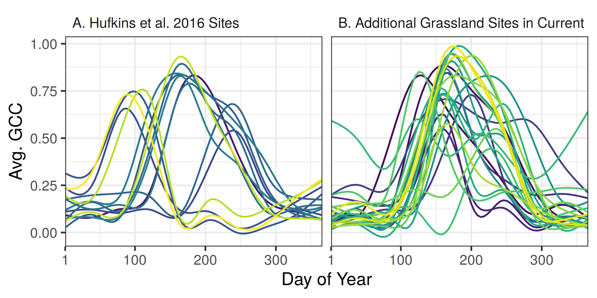

\introduction

Grassland systems span nearly 30% of the global land surface [@adams1990] and play a prominent role in terrestrial carbon cycles [@parton2012]. Grasslands in North America provide a large proportion of food and fiber agricultural products for the region. Annual productivity of grasslands in central and western North America is driven in large part by precipitation [@sala2012]. Future changes in the amount, intensity, and timing of precipitation will be heterogeneous across North America [@easterling2017], resulting in heterogeneous changes to grassland productivity. For example, even with consistent shifts in climate, different locations can experience different changes in productivity due to local-scale responses [@zhang2011;@sala2012;@knapp2017]. This highlights the need for models which can be resolved at small spatial and temporal scales, thus making long-term grassland productivity forecasts as informative as possible.

There are several potential limitations in the underlying productivity models which can drive such a forecast. Process-based models parameterized with observed data have limited transferability beyond the spatial extent from which their training data came [taylor2019]. For any location the most accurate model will be one which was parameterized from locally collected data, yet these site-specific models will not generalize to new locations [@basler2016]. Incorporating more, and diverse, locations into the model building process will allow it to be more generalizable, yet this comes at a cost of decreased proficiency at all locations [@garcia-mozo2008; @basler2016]. Thus there is an optimal extent in the building and subsequent application of productivity models, which depends on a tradeoff between proficiency at the local scale and applicability at the larger scale.

Here we evaluate a productivity model with the intention of it driving long-term forecasts. The PhenoGrass model developed by @hufkens2016 is a pulse-response productivity model with temperature and precipitation as the primary drivers. The model is parameterized using observations from the Phenocam network, which have a small resolution  (footprints of < 1ha), sub-daily sampling and sites across all major biomes. These attributes make the PhenoGrass model potentially widely applicable. We expand on the evaluation of the original study by using 445 additional site-years of data from 77 new sites. We test the model’s performance across varying combinations of North American ecoregions and vegetation types to find an optimal spatial extent and/or ecoregion for which to parameterize and apply the model. Finally we address where the model performs poorly and how productivity forecasts for these areas could be implemented or improved.

# Methods

## PhenoGrass Model

The PhenoGrass model is an ecohydrology model which has interacting state variables for soil water, plant available water, and plant fractional cover [@hufkens2016]. Model inputs are daily precipitation, temperature, potential evapotranspiration (derived from the Hargreaves equation [@hargreaves1985]), and solar radiation. The primary output is fractional vegetation cover. The original model form, derived in Choler et 2010 and Choler et al. 2011, used only temperature and potential evapotranspiration and was parameterized using satellite-derived NDVI data. @hufkens2016 expanded on the original Choler model by incorporating growth and sensece restraints from temperature and solar radiation, and also included a scaling factor to convert Phenocam GCC data to a fractional cover estimate. @hufkens2016 evaluated the PhenoGrass model using 14 grassland Phenocam sites across Western North America with a total of 34 site years. They found the modelled fractional cover correlated well with annual productivity at both a daily and annual timescale.  

## Phenocam Data

The Phenocam network is a global network of fixed, near-surface cameras capturing true-color images of vegetation throughout the day [@richardson2018a]. Using a ratio of the three RGB bands a greenness metric (GCC) is calculated from each image, resulting in a daily scale time series of canopy greeness. GCC is a unitless metric which is highly correlated with satellite derived NDVI [@richardson2018b] and flux tower derived primary productivity [@yan2019; @toomey2015]. Each Phenocam image is subset to one to several different plant vegetation types based on the field of view. These regions of interest (ROI) serve as the basis for the GCC calculation and subsequent post-processing [@seyednasrollah2019].  

We downloaded all Phenocam data with ROIs of the grasslands (GR), shrublands (SH), and agricultural (AG) vegetation types for the years 2012 to 2018, totalling 91 sites and 479 site-years (Fig. 1). As input to the PhenoGrass model we used the 3-day smoothed GCC scaled, for each ROI, from 0-1. In the model parameterization each ROI time series is further transformed to a fractional cover estimate using the local mean annual precipitation (MAP) combined with a scaling factor [@hufkens2016; @donohue2013].

```{r, out.width = "12cm", echo = FALSE, fig.cap = "Locations of Phenocam sites. Color indicates the vegetation type represented at each site. Vegetation type is defined by the PhenoCam Network. Shading indicates E.P.A. North American Level 1 Ecoregions."}
knitr::include_graphics("figs/fig1_map.png")
```

## Environmental Data

For historic precipitation and temperature we used the daily 4-km resolution Daymet dataset [@daymet]. Climate time series were extracted for the pixel at the location of each phenocam tower. Daily mean temperature was calculated as the average between the Daymet daily minimum and maximum temperature, and smoothed with a 15 day moving average. Potential evapotranspiration was calculated using the Hargreaves equation [@hargreaves1985]. Soil wilting point and field capacity were extracted at each Phenocam location from a global dataset [@soil2000].

## Model Evaluation

We used a three-step process to evaluate the PhenoGrass model at different spatial extents. First, we parameterized a suite of 15 PhenoGrass models comprising four different extents to find the most appropriate one to make forecasts (Fig. 1). The largest extent used all Phenocam locations described above (84 sites). Next were all sites, respectively, within the three vegetation types (grasslands, shrublands, and agricultural), and all sites, respectively, within each of the four ecoregions (North American Deserts, Great Plains, NW Forests, Eastern Temperate Forests) [@omernik2014]. Finally, we parameterized models for each vegetation type within each ecoregion (eg. All grassland locations within the Great Plains ecoregion). All sets of parameterized models were limited to have at least five sites.

Second, using the same combinations of sites described above, we applied each model parameterization to its respective extent as well as each one below it. For example, sites within the grassland vegetation type were tested using the grassland only model as well as the all site  model. All sites within the Great Plains ecoregion were tested using its own model as well as the all site model. The shrubland vegetation sites within the N.A. Deserts ecoregion were tested using its respective model, the N.A. Deserts, and the all site model. There was no cross-validation using out of sample data in this step as it would have been computationally expensive. Rather, these fitting data metrics were treated as a best case scenario in what each model parameterization can achieve. From these results we used a threshold to select which model to evaluate further using cross-validation at the appropriate scale. For the error metric we chose the coefficient of determination calculated for each site, and averaged across all sites in the respective evaluation. We used a threshold of 0.65, which is viewed as "acceptable" for time-series models [@ritter2013].

```{r, out.width = "8.3cm", echo = FALSE, fig.cap = "Scaling representation of the 15 model parameterizations. Numbers in parentheses represent the number of sites and site years, respectively. Each model uses a different subset of sites ranging from the entire dataset (All Site Model) to one vegetation type within an ecoregion (e.g., Eastern Temperate Forest Grasslands)."}
knitr::include_graphics("figs/fig2_scales.png")
```

Third, models which exceed the threshold described above were subject to further evaluation. For each model we performed a leave one out cross-validation, where the model was re-fit with one Phenocam site not included in the training data, and then evaluated against the left out site. In this step a scaling coefficient to link mean annual precipitation with PhenoCam GCC was held constant at the value obtained in step two. The resulting coefficient of determination is the average among all modelled sites using their respective out of sample test.

All phenocam data was downloaded using the phenocamr R package [@hufkens2018]. Other packages used in the R 3.6 language were dplyr [@dplyr], tidyr [@tidyr], ggplot2 [@ggplot2], daymetr [@hufkens2018], rgdal [@rgdal2019], and sf [@sf2018]. Python 3.7 packages included scipy [@scipy2020], numpy [@numpy2011], pandas [@pandas], and dask [@dask].  All code and data used in the analysis is available in the repository at https://github.com/sdtaylor/PhenograssReplication, the PhenoGrass model is implemented in a python package https://github.com/sdtaylor/GrasslandModels. Both are archived permanently on Zenodo (link).  

# Results

At the largest extent, where the phenograss model was parameterized using all 91 sites, the model performed poorly with an average R\textsuperscript{2} value among sites of 0.33. The error of this largest extent model when applied across different subsets of sites (Table 1, leftmost column) shows that agricultural and North American desert sites contribute most to this low R\textsuperscript{2}, while some grassland sites performed well in this regard. Models built at the ecoregion or vegetation type extent also performed poorly overall. The best model performance was achieved when models were built using a single vegetation type subset to ecoregions. 

The grassland vegetation type, subset to specific ecoregions, predominantly outperformed other iterations of the PhenoGrass model (Table 1). Models built using grasslands within the Eastern Temperate Forest and Great Plains ecoregions had the highest average R\textsuperscript{2} values of 0.82 and  0.70, respectively. Using leave one out cross-validation on these two grassland model iterations resulted in similar errors of 0.78 and 0.67 for the Eastern Temperate Forest and Great Plains, respectively. Grasslands in the North American deserts were not modelled well at any extent and had the lowest R\textsuperscript{2} values in the entire analysis.

Agriculture and shrubland sites were poorly modelled at all extents. The highest average R\textsuperscript{2} at any extent was 0.51, and 0.39 for shrubland and agriculture, respectively. Shrublands in North American Deserts improved as the model became more and more localized, but never exceeded the 0.65 threshold. 

\begin{table}
\caption{Average site-level coefficient of determination (R\textsuperscript{2}) for each vegetation type and ecoregion group parameterized model applied to its respective extent as well as appropriate smaller extents. Bold indicates when a R\textsuperscript{2} was greater than the “acceptable” threshold of 0.65. Values in parentheses represent the average R\textsuperscript{2} in leave-1-out cross validation.}
\begin{tabular}{l|r|r|r|r}
\hline
 & All Site Model & Ecoregion Model & Vegetation Model & Ecoregion+Vegetation Model\\
\hline
All Sites & 0.33 &  &  & \\
\hline
\textbf{E. Temperate Forests} & 0.43 & 0.48 &  & \\
\hline
\hspace{1em}Agriculture & 0.34 & 0.39 & 0.38 & 0.33\\
\hline
\hspace{1em}Grasslands & 0.73 & 0.79 & 0.65 & 0.82\\
\hline
\textbf{Great Plains} & 0.45 & 0.45 &  & \\
\hline
\hspace{1em}Agriculture & 0.22 & 0.15 & 0.17 & 0.18\\
\hline
\hspace{1em}Grasslands & 0.64 & 0.70 & 0.67 & 0.70\\
\hline
\textbf{N. American Deserts} & -0.11 & 0.14 &  & \\
\hline
\hspace{1em}Grasslands & -0.51 & -0.22 & -0.51 & -0.08\\
\hline
\hspace{1em}Shrublands & 0.15 & 0.37 & 0.40 & 0.51\\
\hline
\textbf{N.W. Forests} & 0.25 & 0.58 &  & \\
\hline
\hspace{1em}Grasslands & 0.30 & 0.61 & 0.36 & 0.64\\
\hline
\textbf{All Agriculture} & 0.27 &  & 0.26 & \\
\hline
\textbf{All Grasslands} & 0.43 &  & 0.45 & \\
\hline
\textbf{All Shrublands} & 0.23 &  & 0.39 & \\
\hline
\end{tabular}
\end{table}

# Discussion

We performed an extensive evaluation of the PhenoGrass model across ecoregions and vegetation types to determine the best extent at which to parameterize and apply the model. We found the model most suitable to grassland vegetation when constrained to the ecoregion level, though it did not perform well in grasslands in the North American desert ecoregion. Shrublands and agriculture were not well represented by the model regardless of the extent. Results from this study will facilitate long-term forecasts of grassland productivity constrained to an appropriate vegetation type and extent. 

The PhenoGrass model performed best in grassland sites embedded within ecoregions. Studies using earlier forms of the model applied it exclusively to grasslands [@choler2010, @choler2011, @hufkens2016], and results here confirm that it performs well in grassland vegetation with two exceptions. The model did not work in the desert grasslands, nor did it generalize well when built using all North American grasslands simultaneously. Grasslands in the N.A. Desert biome coexist with shrubs, resulting in complex water usage dynamics described in more detail below. The pulse-response design of PhenoGrass, which makes it well suited in areas with high cover of perennial grass, is likely not applicable when grasses are interspersed with woody plants. 

Shrublands were not well modelled at any extent. Dryland shrubs, representing 8 of the 15 shrubland Phenocams analysed here, coexist with grasses by accessing different pools of soil water [@weltzin2000; @muldavin2008], thus have different responses to precipitation and resulting greenness patterns [@browning2017; @yan2019]. A prior form of the PhenoGrass model was designed to work with dryland shrubs [@ogle2004], yet here PhenoGrass showed little effectiveness. The current model form has only a single soil water pool with fluxes from precipitation and evapotranspiration, thus is not well-suited for representing the deeper water pools which shrubs use. Potential improvements would likely need to incorporate a deep soil water pool, in addition to the shallow, which are each utilized by the respective plant functional groups. This has already been implemented in highly parameterized ecohydrology models [cites] and could potentially be used here to make a more generalized PhenoShrub model to apply across large scales. This approach could also help in modelling N.A. Desert grasslands which coexist among shrubs. 

Agriculture areas performed poorly with the PhenoGrass model. Management practices of crops artificially increase productivity beyond what would naturally occur, and planting and harvest result in abrupt changes in greenness metrics [@begue2018]. While the results here are unsurprising, to our knowledge this is the first attempt to use near-surface images to drive an agricultural productivity model. We have shown that the PhenoGrass model, designed for natural systems, does not generalize to managed agriculture crops. Future work in using Phenocam data to model agricultural productivity would likely need to incorporate crop specific parameters and management activity, which other cropland modelling systems use [@fritz2019]. The integration of the Phenocam network within the Long-Term Agricultural Research (LTAR) will likely be beneficial for this, as the timing and intensity of management activities or experimental treatments can be incorporated into modelling efforts. 

@hufkens2016 originally evaluated the Phenograss model using 14 grassland sites distributed among seven North American ecoregions. In their evaluation they had an average R\textsuperscript{2} of 0.71, while here the model performed poorly when using more than 1 ecoregion. It’s likely that the original 14 grassland sites were ideal locations for the PhenoGrass model, since on average they have a single greenup season every year in the spring or summer (Fig. 3A). The additional 24 grassland sites used in the current study have high seasonal variability and elongated growing seasons (Fig. 3B), and were thus more difficult to represent in a single continental scale grassland model. 

```{r, out.width = "12cm", echo = FALSE, fig.cap = "Smoothed time series for all 14 grassland sites used in Hufkens et al 2016 (A) and 24 additional grassland sites added in the current study (B). Each line represents the long-term average Green Chromatic Coordinate (GCC) of a single site across all available years, smoothed using a GAM model."}

```

\conclusions

Replication is an important step in the scientific process, especially given newly available data. Here we have validated prior modelling work and highlighted its limitations. Newer small scale vegetation models can be validated in the same framework and applied to areas where PhenoGrass performs poorly. This can result in a spatial ensemble where the output for any one location and vegetation type is represented by the most appropriate model. Our current work will allow for long-term small scale forecasts of grassland productivity for a large fraction of North America.