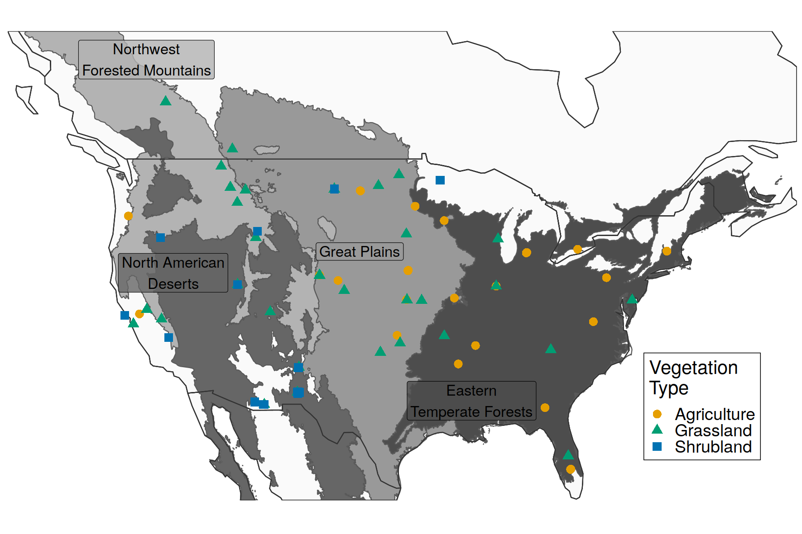
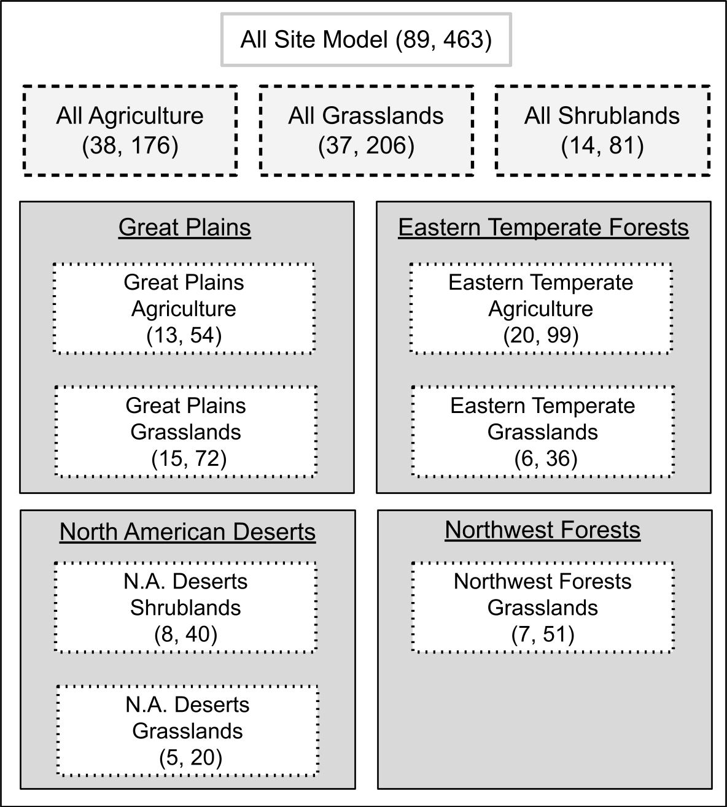
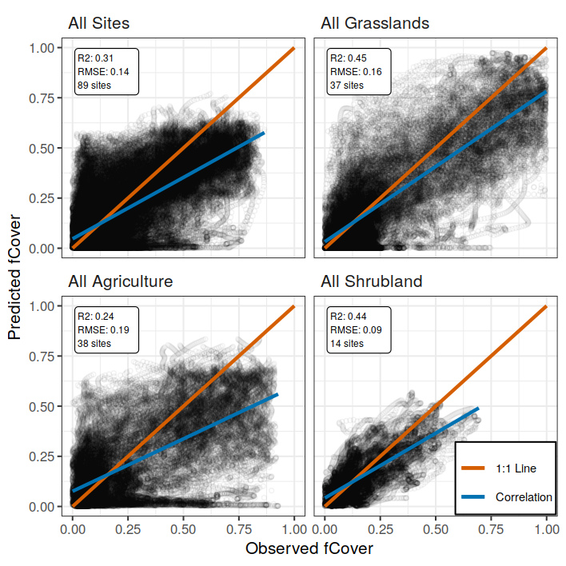
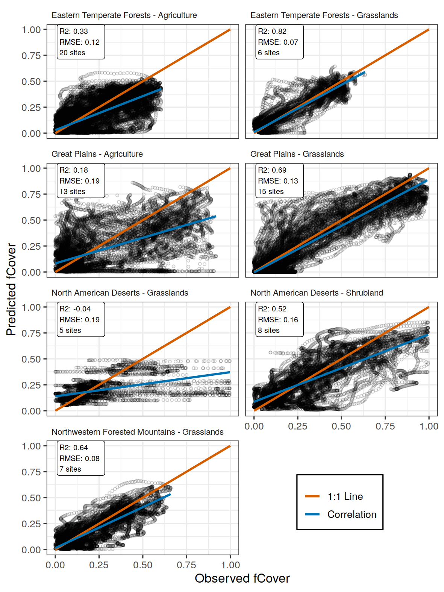
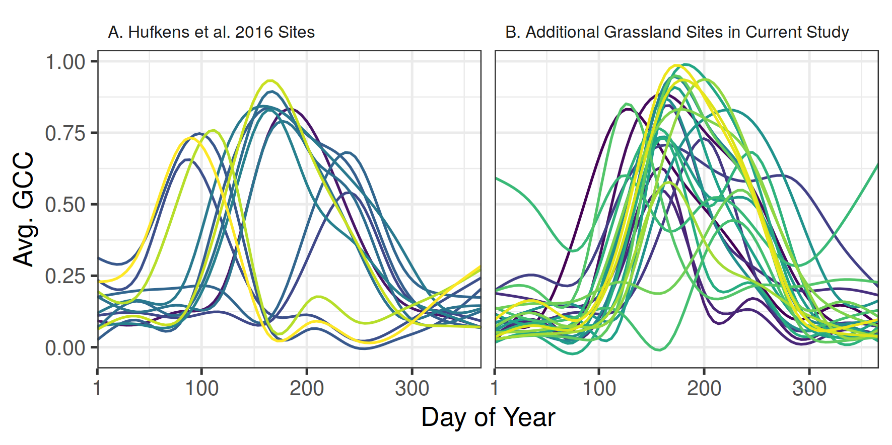

\introduction

Grassland systems span nearly 30% of the global land surface [@adams1990] and play a prominent role in terrestrial carbon cycles [@parton2012]. Grasslands in North America provide a large proportion of food and fiber agricultural products for the region. Annual productivity of grasslands in central and western North America is driven in large part by precipitation [@sala2012]. Future changes in the amount, intensity, and timing of precipitation will be heterogeneous across North America [@easterling2017], resulting in heterogeneous changes to grassland productivity. For example, even with consistent shifts in climate, different locations can experience different changes in productivity due to local-scale responses [@zhang2011;@sala2012;@knapp2017]. This highlights the need for models which can be resolved at small spatial and temporal scales, thus making long-term grassland productivity projections as informative as possible.

There are several potential limitations in the underlying productivity models which can drive such a projection. Process-based models parameterized with observed data have limited transferability beyond the spatial scale from which their training data came [@taylor2019a]. For any location the most accurate model will be one which was parameterized from locally collected data, yet these site-specific models will not generalize to new locations [@basler2016]. Incorporating more, and diverse, locations into the model building process will allow it to be more generalizable, yet this comes at a cost of decreased proficiency at all locations [@garcia-mozo2008; @basler2016]. Thus there is an optimal scale in the building and subsequent application of productivity models, which depends on a tradeoff between proficiency at the local scale and applicability at the larger scale.

Here we evaluate a productivity model with the intention of it driving long-term projections. The PhenoGrass model developed by @hufkens2016 is a pulse-response productivity model with temperature and precipitation as the primary drivers. The model is parameterized using observations from the PhenoCam network, which have a small spatial resolution  (footprints of < 1ha), sub-daily sampling and sites across all major biomes. These attributes make the PhenoGrass model potentially widely applicable. We expand on the evaluation of the original study by using 84 PhenoCam sites, totalling 89 distinct time series, with 463 site-years of data. We test the model’s performance across varying combinations of North American ecoregions and vegetation types to find an optimal spatial scale in which to parameterize and apply the model. Finally we address where the model performs poorly and how productivity projections for these areas could be implemented or improved.

# Methods

## PhenoGrass Model

The PhenoGrass model is an ecohydrology model which has interacting state variables for soil water, plant available water, and plant fractional cover [@hufkens2016]. Model inputs are daily precipitation, temperature, potential evapotranspiration (derived from the Hargreaves equation, @hargreaves1985), and solar radiation. The primary output is fractional vegetation cover (fCover). The original model form, derived in Choler et 2010 and Choler et al. 2011, used only temperature and potential evapotranspiration and was parameterized using satellite-derived NDVI data. @hufkens2016 expanded on the original Choler model by incorporating growth and senescence restraints from temperature and solar radiation, and also included a scaling factor to convert PhenoCam G\textsubscript{cc} data to a fractional cover estimate. @hufkens2016 evaluated the PhenoGrass model using 14 grassland PhenoCam sites across Western North America with a total of 34 site years. They found the modelled fractional cover correlated well with annual productivity at both a daily and annual timescale.  

## Phenocam Data

The PhenoCam network is a global network of fixed, near-surface cameras capturing true-color images of vegetation throughout the day [@richardson2018a]. Using a ratio of the three RGB bands a greenness metric (green chromatic coordinate, G\textsubscript{cc}) is calculated from each image, resulting in a daily scale time series of canopy greeness. G\textsubscript{cc} is a unitless metric which is highly correlated with satellite derived NDVI [@richardson2018b] and flux tower derived primary productivity [@yan2019; @toomey2015]. Each Phenocam image is subset to one to several different plant vegetation types based on the field of view. These regions of interest (ROI) serve as the basis for the G\textsubscript{cc} calculation and subsequent post-processing [@seyednasrollah2019].  

We downloaded all Phenocam data with ROIs of the grasslands (GR), shrublands (SH), and agricultural (AG) vegetation types for the years 2012 to 2018, totalling 89 distinct time series  and 463 site-years (Fig. 1, Table S1). As input to the PhenoGrass model we used the 3-day smoothed G\textsubscript{cc} scaled, for each ROI, from 0-1. In the model parameterization each ROI time series is further transformed to a fractional cover estimate using the local mean annual precipitation (MAP) combined with a scaling factor [@hufkens2016; @donohue2013].

```{r, out.width = "12cm", echo = FALSE, fig.cap = "Locations of Phenocam sites. Color indicates the vegetation type represented at each site. Vegetation type is defined by the PhenoCam Network. Shading indicates E.P.A. North American Level 1 Ecoregions."}

```

## Environmental Data

For historic precipitation and temperature we used the daily 4-km resolution Daymet dataset [@daymet]. Climate time series were extracted for the pixel at the location of each phenocam tower. Daily mean temperature was calculated as the average between the Daymet daily minimum and maximum temperature, and smoothed with a 15 day moving average. Potential evapotranspiration was calculated using the Hargreaves equation [@hargreaves1985]. Soil wilting point and field capacity were extracted at each Phenocam location from a global dataset [@soil2000].

## Model Evaluation

To find the most appropriate scale we evaluated the model using three different combinations of ecoregion and vegetation type, with 11 total model parameterizations (Fig. 2). Here we use the term “spatial scale” to refer to the combination of ecoregion/s and vegetation type/s used within each model. This includes using all vegetation types with an ecoregion, or all sites of a specific vegetation type from several ecoregions. The largest scale used all Phenocam locations described above (89 sites). Next were all sites, respectively, within the three vegetation types indicated by the ROI (grasslands, shrublands, and agricultural). Finally, we parameterized models for each vegetation type within each Level 1 North American Ecoregion (eg. All grassland sites within the Great Plains ecoregion). All sets of parameterized models were limited to have at least five sites.

We evaluated each of the 11 models using the coefficient of determination (R\textsuperscript{2}) and root mean square error (RMSE) of the daily fractional cover estimates. R\textsuperscript{2} and RMSE were calculated for each site and then averaged across all sites within the respective scale. There was no cross-validation using out of sample data in the initial fitting as it would have been computationally expensive. Rather, error metrics from these in-sample tests were treated as a best case scenario in what each model parameterization can achieve. From these results we used a threshold to select which models to evaluate further using cross-validation. The threshold value was an R\textsuperscript{2} threshold of 0.65, which is viewed as "acceptable" for time-series models [@ritter2013].

Parameterization was done using differential evolution, a global optimization algorithm, to minimize the mean coefficient of variation of the mean absolute error (\textit{F}, Eq. 1), which accounts for variation among sites [@choler2011].

\begin{equation}
F = \frac{1}{N}\sum_{j=1}^{N}CVMAE_{j}
\end{equation}


\begin{equation}
CVMAE_{j} = \frac{\frac{1}{i}\sum_{i=1}^{n}|fCover_{i,obs} - fCover_{i,pred}|}{\overline{fCover_{obs}}}
\end{equation}

where \textit{N} is the number of sites and \textit{n} is the number of daily values at each site, \textit{fCover\textsubscript{i,obs}} and \textit{fCover\textsubscript{i,pred}} are observed and predicted values, respectively. \textit{fCover\textsubscript{pred}} is the average observed \textit{fCover} at each site.
 

```{r, out.width = "8.3cm", echo = FALSE, fig.cap = "Scaling representation of the 11 model parameterizations. Numbers in parentheses represent the number of sites and site years, respectively. Each model uses a different subset of sites ranging from the entire dataset (All Site Model) to one vegetation type within an ecoregion (e.g., Eastern Temperate Forest Grasslands)."}

```

Models which exceed the threshold were subject to further evaluation. For each model we performed a leave one out cross-validation, where the model was re-fit with one Phenocam site not included in the training data, and then evaluated against this left out site. In this step a scaling coefficient to link mean annual precipitation with PhenoCam G\textsubscript{cc} was held constant at the value obtained in first fitting. The resulting R\textsuperscript{2} and RMSE are the average among all modelled sites using their respective out of sample test.

All phenocam data were downloaded using the phenocamr R package [@hufkens2018]. Other packages used in the R 3.6 language were dplyr [@dplyr], tidyr [@tidyr], ggplot2 [@ggplot2], daymetr [@hufkens2018], rgdal [@rgdal2019], and sf [@sf2018]. Python 3.7 packages included scipy [@scipy2020], numpy [@numpy2011], pandas [@pandas], and dask [@dask].  All code and data used in the analysis is available in the repository at https://github.com/sdtaylor/PhenograssReplication, the PhenoGrass model is implemented in a python package https://github.com/sdtaylor/GrasslandModels. Both are archived permanently on Zenodo (https://doi.org/10.5281/zenodo.3897319). 

# Results

At the largest scale, where the PhenoGrass model was parameterized using all 89 sites, the model performed poorly with an average R\textsuperscript{2} value among sites of 0.31 (Table 1; Fig. 3). Models built using all sites of a respective vegetation type performed poorly as well, though were slightly better than the all site model (Fig. 3). The best model performance was achieved when models were built using a single vegetation type subset to a single ecoregion. Grasslands within the Great Plains and Eastern Temperate Forests ecoregions were the only instances where R\textsuperscript{2} exceeded the 0.65 threshold, though Grasslands within N.W. Forests came close (R\textsuperscript{2} = 0.64). 

```{r, out.width = "12cm", echo = FALSE, fig.cap = "Observed and predicted fCover values of the All Site model using all available data, and the three vegetation type models each using all PhenoCam sites with an ROI in the respective vegetation type. "}

```

```{r, out.width = "12cm", echo = FALSE, fig.cap = "Observed and predicted fCover values for seven model iterations where only sites with a specified vegetation type within a single ecoregion were used in model fitting."}

```

In all 11 iterations the PhenoGrass model tended to underestimate the highest fCover values, and to a lesser degree overpredict the lowest values (Figs. 3,4). The best performing iterations (Grasslands in the Great Plains and Eastern Temperate forests) minimized this effect (Fig. 4). The worst performing iteration, Grasslands in N.A. Deserts, had little variation in predicted fCover values, resulting in the lowest R\textsuperscript{2} overall. 

The grassland vegetation type, subset to specific ecoregions, predominantly outperformed other iterations of the PhenoGrass model (Table 1). Models built using grasslands within the Eastern Temperate Forest and Great Plains ecoregions had the highest average R\textsuperscript{2} values of 0.82 and  0.69, respectively. Using leave one out cross-validation on these two grassland model iterations resulted in similar errors of 0.79 and 0.67 for the Eastern Temperate Forest and Great Plains, respectively. Though N.W. Forests grasslands had an in-sample R\textsuperscript{2} just below the 0.65 threshold, the cross-validation was well below it (0.52). Grasslands in the North American deserts were not modelled well at any scale and had the lowest R\textsuperscript{2} values in the entire analysis. The observed greenness patterns of these desert grasslands had extremely high variability in their magnitude and timing, with short distinct peaks in greenness and numerous off-peak fluctuations. The fitted model, which minimized the mean CVME among the 5 sites, was not able to reproduce this high variability and instead produced fCover values that were severely constrained to a narrow range (Fig. S1). 

Agriculture and shrubland sites were poorly modelled at all scales. Performance of agriculture within the E. Temperate Forest ecoregion (R\textsuperscript{2} = 0.33) improved over the All Agriculture model (R\textsuperscript{2} = 0.18), but decreased in the Great Plains (from 0.24 to 0.18). There was only a single ecoregion with a minimum of five shrubland sites, N.A. Deserts, and it performed only slightly better than the All Shrubland model. Shrublands in N.A. Deserts did not have the high variability seen in desert grasslands. 

\begin{table}
\caption{Average site-level coefficient of determination (R\textsuperscript{2}) and root mean square error (RMSE) for each model parameterization. Bold indicates when the R\textsuperscript{2} was greater than the acceptable threshold of 0.65. Values in parentheses represent the average R\textsuperscript{2} in leave-1-out cross validation.}
\begin{tabular}{l|l|r|r|r}
\hline
 & R\textsuperscript{2} & RMSE & Num. Sites & Site Years\\
\hline
All Sites & 0.31 & 0.14 & 89 & 462.5\\
\hline
All Agriculture & 0.24 & 0.19 & 38 & 175.7\\
\hline
All Grasslands & 0.45 & 0.16 & 37 & 205.8\\
\hline
All Shrublands & 0.44 & 0.09 & 14 & 81.0\\
\hline
\textbf{E. Temperate Forests} &  &  &  & \\
\hline
\hspace{1em}Agriculture & 0.33 & 0.12 & 20 & 99.2\\
\hline
\hspace{1em}Grasslands & \textbf{0.82 (0.79)} & 0.07 & 6 & 35.7\\
\hline
\textbf{Great Plains} &  &  &  & \\
\hline
\hspace{1em}Agriculture & 0.18 & 0.19 & 13 & 54.3\\
\hline
\hspace{1em}Grasslands & \textbf{0.69 (0.67)} & 0.13 & 15 & 71.5\\
\hline
\textbf{N. American Deserts} &  &  &  & \\
\hline
\hspace{1em}Grasslands & -0.04 & 0.19 & 5 & 20.3\\
\hline
\hspace{1em}Shrublands & 0.52 & 0.16 & 8 & 39.7\\
\hline
\textbf{N.W. Forests} &  &  &  & \\
\hline
\hspace{1em}Grasslands & 0.64 (0.52) & 0.08 & 7 & 50.7\\
\hline
\end{tabular}
\end{table}

# Discussion

We performed an extensive evaluation of the PhenoGrass model across ecoregions and vegetation types to determine the best scale at which to parameterize and apply the model. We found the model most suitable to grassland vegetation when constrained to the ecoregion level, though it did not perform well in grasslands in the North American desert ecoregion. Shrublands and agriculture were not well represented by the model regardless of the scale. Results from this study will facilitate long-term projections of grassland productivity constrained to an appropriate vegetation type and scale.

The PhenoGrass model performed best in grassland sites embedded within ecoregions. Studies using earlier forms of the model applied it exclusively to grasslands [@choler2010; @choler2011; @hufkens2016], and results here confirm that it performs well in grassland vegetation with two exceptions. The model did not work in the desert grasslands, nor did it generalize well when built using all North American grasslands simultaneously. Grasslands in the N.A. Desert biome coexist with shrubs, resulting in complex water use dynamics described in more detail below. The pulse-response design of PhenoGrass, which makes it well suited in areas with high cover of perennial grass, is likely not applicable when grasses are interspersed with woody plants.

Shrublands were not well modelled at any scale. Dryland shrubs, representing 8 of the 15 shrubland PhenoCams analysed here, coexist with grasses by accessing different pools of soil water [@weltzin2000; @muldavin2008], thus have different responses to precipitation and resulting greenness patterns [@browning2017; @yan2019]. A prior form of the PhenoGrass model was designed to work with dryland shrubs by using two soil water pools [@ogle2004], yet here PhenoGrass, with a single soil water pool, was less effective for shrubland vegetation. The single pool of the PhenoGrass model is coupled with fluxes from precipitation and evapotranspiration, thus is not well-suited for representing the deeper water pools that shrubs can routinely access [@schenk2002; @ward2013]. Potential improvements would likely need to incorporate a deep soil water pool, in addition to the shallow, which are each utilized by the respective plant functional groups. This has already been implemented in highly parameterized ecohydrology models [@scanlon2005;@lauenroth2014] and could potentially be used here to make a more generalized PhenoShrub model to apply across large scales. This approach could also help in modelling N.A. Desert grasslands which coexist among shrubs.

Agriculture areas performed poorly with the PhenoGrass model. Management practices of crops artificially increase productivity beyond what would naturally occur, and planting and harvest result in abrupt changes in greenness metrics [@begue2018]. While the results were not necessarily surprising, to our knowledge this is the first attempt to use near-surface images to drive an productivity model for agricultural vegetation. We have shown that the PhenoGrass model, designed for natural systems, does not generalize to actively managed agricultural systems. Future work in using PhenoCam data to model agricultural productivity would likely need to incorporate crop specific parameters and management activity, which other cropland modelling systems use [@fritz2019]. The integration of the PhenoCam network within the Long-Term Agricultural Research (LTAR) will likely be beneficial for this, as the timing and intensity of management activities or experimental treatments can be incorporated into modelling efforts.

@hufkens2016 originally evaluated the PhenoGrass model using 14 grassland sites distributed among seven North American ecoregions. In their evaluation they had an average R\textsuperscript{2} of 0.71, while here the model performed poorly when using more than 1 ecoregion. It’s likely that the original 14 grassland sites were ideal locations for the PhenoGrass model, since on average they have a single greenup season every year in the spring or summer (Fig. 5A). The additional 24 grassland sites used in the current study have high seasonal variability and elongated growing seasons (Fig. 5B, Fig. S1), and were thus more difficult to represent in a single continental scale grassland model.


```{r, out.width = "12cm", echo = FALSE, fig.cap = "Smoothed time series for all 14 grassland sites used in Hufkens et al 2016 (A) and 24 additional grassland sites added in the current study (B). Each line represents the long-term average Green Chromatic Coordinate of a single site across all available years, smoothed using a GAM model."}

```

\conclusions

Replication is an important step in the scientific process, especially given newly available data. Here we have validated prior modelling work and highlighted its limitations. Newer small scale vegetation models can be validated in the same framework and applied to areas where PhenoGrass performs poorly. This can result in a spatial ensemble where the output for any one location and vegetation type is represented by the most appropriate model. Our current work will allow for long-term small scale projections of grassland productivity for a large fraction of North America.
